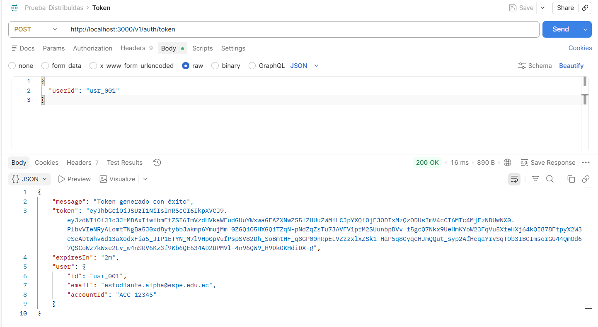
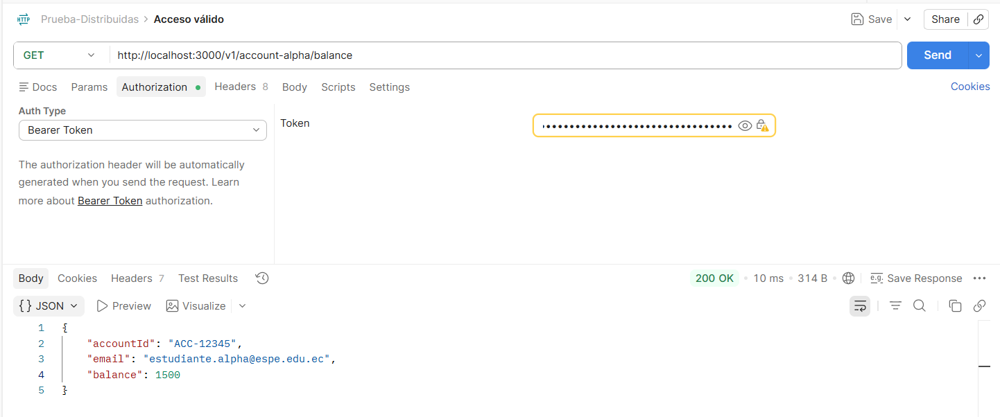
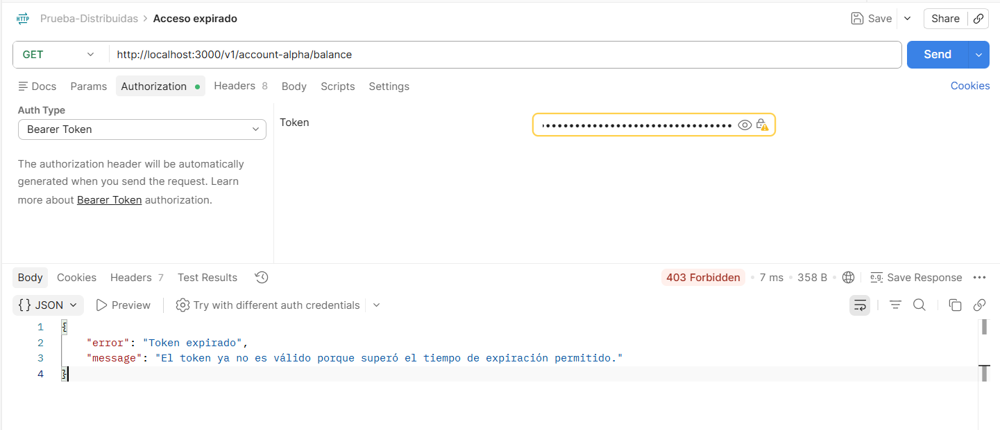
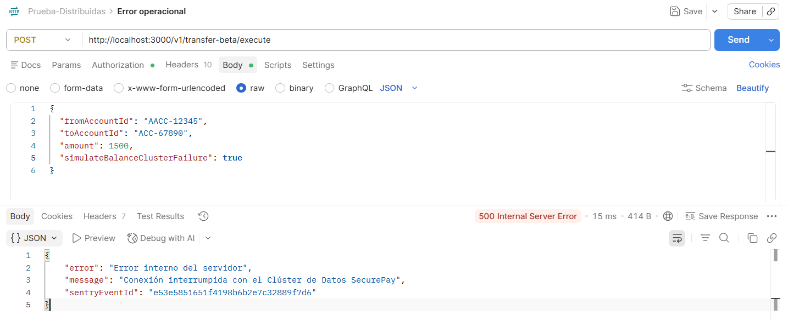
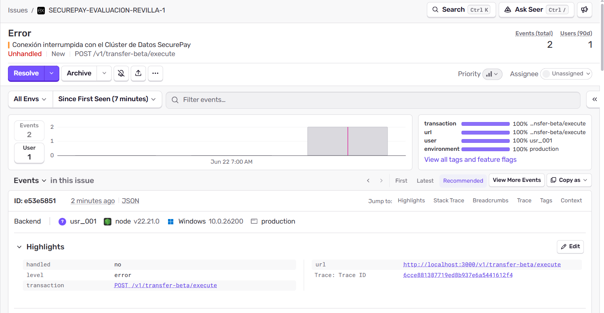
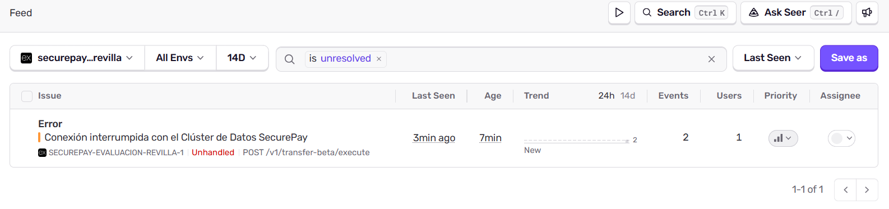
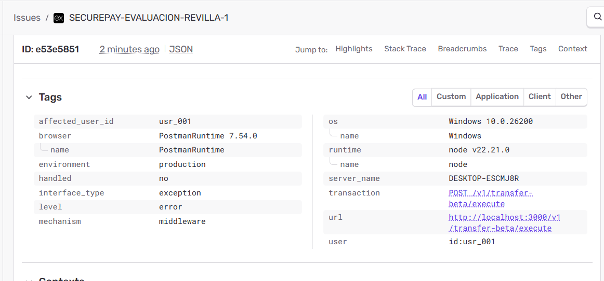

# Bitácora de Evaluación

## Postman

### 1. Token generado
Se generó correctamente el token JWT desde el endpoint `POST /v1/auth/token`, validando que el backend pueda entregar una identidad firmada para el usuario.

### 2. Acceso válido
Se probó el acceso a un endpoint protegido usando un token vigente en la cabecera Authorization.

### 3. Acceso con token expirado
Se esperó a que el token expire y se validó que el backend responda de forma controlada con un código de seguridad, sin tratarlo como un error interno del servidor.

### 4. Error operacional 500
Se simuló el fallo de conexión con el clúster de datos en el endpoint `POST /v1/transfer-beta/execute`, comprobando que el sistema responda como un error operacional.

## Sentry

### 5. Evento registrado
Se verificó que el error operacional 500 fue capturado correctamente en Sentry.

### 6. Dashboard
Se capturó la vista general del proyecto en Sentry donde se muestra el incidente registrado.

### 7. Tag del usuario afectado
Se evidenció que el error llegó a Sentry con el tag personalizado del usuario obtenido desde el JWT.

